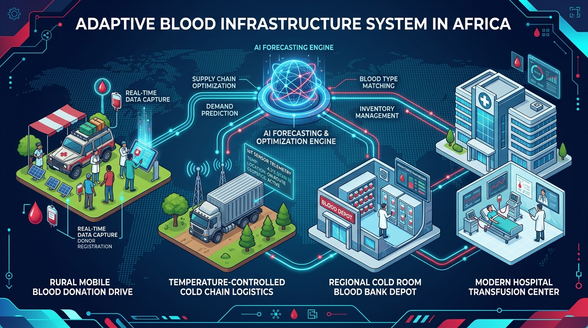
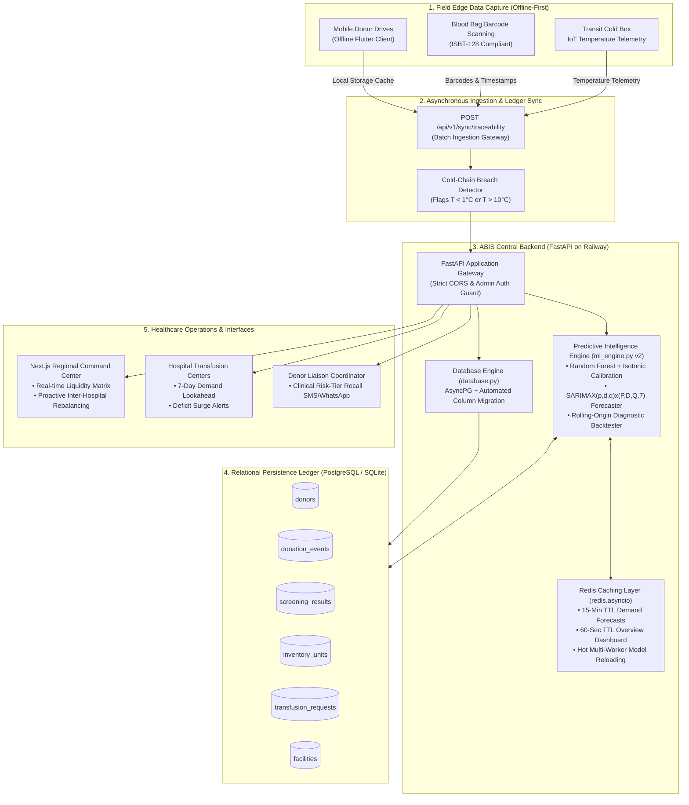
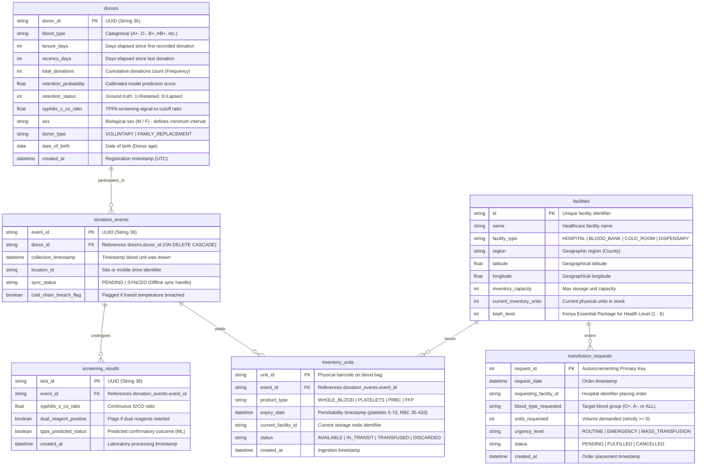
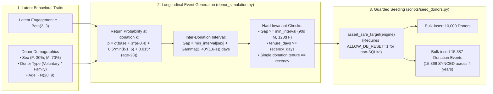

# Adaptive Blood Infrastructure System (ABIS) — Backend Engine
### Terumo BCT Africa Hackathon 2026: Building Better Blood Systems for Africa

[](https://fastapi.tiangolo.com)
[](https://python.org)
[](https://www.sqlalchemy.org)
[](https://scikit-learn.org)
[](https://www.statsmodels.org)
[](https://redis.io)
[](https://www.postgresql.org)
[]()
[](https://railway.app)

---



---

## 1. System Overview & The African Healthcare Reality

Blood is an ultra-perishable, non-substitutable therapeutic asset with volatile supply and stochastic, non-negotiable demand. Across sub-Saharan Africa, blood supply chains face structural vulnerabilities:
- **Inventory Blind Spots:** Major referral hospitals experience acute stockouts for postpartum hemorrhage and emergency trauma, while regional clinics 45 km away discard expiring units due to lack of coordination.
- **Traceability & Cold-Chain Fragility:** When blood units transit through rural zones with intermittent cellular network connectivity, temperature telemetry lapses, risking cold-chain breaches ($2^\circ\text{C} - 6^\circ\text{C}$ whole blood/PRBC; $20^\circ\text{C} - 24^\circ\text{C}$ platelets).
- **High Donor Lapse Rates:** Up to 70% of first-time blood donors never return, due to lack of personalized, habituation-aware donor recall systems.

### The Unified ABIS Architecture
The **Adaptive Blood Infrastructure System (ABIS)** unifies these challenges into a single resilient platform:
1. **Decentralized Liquidity & Predictive Intelligence Engine:**
   - **Point-in-Time Calibrated Donor Retention:** Modeled from longitudinal donation event streams with purged temporal splits and isotonic probability calibration (ROC AUC: **0.8978**, ECE: **0.0097**).
   - **Seasonal SARIMAX Demand Forecaster:** Automated ADF stationarity differencing and weekly seasonal terms ($s=7$) providing 7-day lookahead projections with Gaussian 95% confidence intervals and automated critical deficit surge detection.
2. **Resilient Offline-First Traceability Ledger:**
   - Field collection events and cold-chain temperature telemetry ingested asynchronously via Flutter mobile clients with idempotent sync states (`PENDING` $\to$ `SYNCED`).
   - Central PostgreSQL relational persistence with automated schema column migrations and multi-worker joblib model synchronization.

---

## 2. End-to-End System Architecture



---

## 3. Relational Data Engineering & Schema

The database schema supports both the operational ledger of blood collection and the mathematical data frames required for temporal predictive modeling:



### 3.1 Schema Migration Defense
When deploying against production PostgreSQL, the backend runs `apply_column_migrations()` automatically during `init_db()`. Alternatively, the migrations can be run directly via [`scripts/migrate_columns.sql`](file:///c:/Users/user/Downloads/PUKKA%20SAM/TERUMO%20BCT%20HACKATHON/terumo_backend/scripts/migrate_columns.sql):

```sql
-- Safe, idempotent column migrations for PostgreSQL:
ALTER TABLE donors ADD COLUMN IF NOT EXISTS sex VARCHAR(1) NULL;
ALTER TABLE donors ADD COLUMN IF NOT EXISTS donor_type VARCHAR(30) NULL;
ALTER TABLE donors ADD COLUMN IF NOT EXISTS date_of_birth DATE NULL;
ALTER TABLE facilities ADD COLUMN IF NOT EXISTS keph_level INTEGER NULL;
ALTER TABLE transfusion_requests ADD COLUMN IF NOT EXISTS status VARCHAR(20) NULL DEFAULT 'PENDING';
```

---

## 4. Event-First Synthetic Data Pipeline

Rather than generating static RFM numbers and computing artificial labels from a formula, the ABIS v2 pipeline simulates **realistic longitudinal donor behavior** from latent behavioral dynamics:



### 4.1 Master Facility Registry & Demand Seeding (`scripts/seed_facilities.py`)
- Reads the official Kenya Master Health Facility List (8,936 facilities).
- Maps each facility to its **KEPH Level (1 through 6)** and operational facility type:
  - **Level 6 (National Referral):** Capacity 800–1,200 units, daily demand $\mu = 80-150$ units.
  - **Level 5 (County Referral):** Capacity 300–500 units, daily demand $\mu = 30-70$ units.
  - **Level 4 (Sub-County Hospital):** Capacity 50–150 units, daily demand $\mu = 5-20$ units.
  - **Level 3 (Health Centre):** Capacity 0–10 units, daily demand $\mu \le 2$ units.
  - **Level 2 (Dispensary):** Strictly 0 capacity, 0 demand (outpatient only).
  - **Blood Hubs / RBTCs:** Capacity 2,000–5,000 units, pure storage/distribution.
- Simulates 730 days of daily transfusion orders via a discrete Ornstein-Uhlenbeck stochastic process with Friday/Saturday emergency trauma multipliers (+20%).

---

## 5. Machine Learning & Predictive Intelligence Engine (v2)

### 5.1 Donor Retention: Calibrated RFM Point-in-Time Pipeline
The retention model predicts the calibrated probability that a donor returns within the clinical horizon ($H = 180\text{ days}$).

```mermaid
flowchart TD
    E[15,366 SYNCED Donation Events] --> C[Generate Multi-Year Cutoff Grid]
    C --> S[Temporal Purged Split<br/>Train: 74,304 | Calib: 16,461 | Test: 16,981]
    S --> F[Point-in-Time Feature Construction<br/>• recency_days • total_donations • tenure_days<br/>• donation_rate • sex • donor_type • age]
    F --> T[Random Forest Classifier<br/>200 Estimators, max_depth=8, min_samples_leaf=50]
    T --> Cal[Probability Calibration<br/>Isotonic Regression on Holdout Calibration Split]
    Cal --> P[Calibrated Risk Scoring<br/>• Low Risk >= 0.70<br/>• At Risk 0.40 - 0.69<br/>• High Risk < 0.40]
    Cal --> Art[Joblib Persistence<br/>model_store/retention_latest.joblib]
    Art --> MWS[Multi-Worker Auto-Reload<br/>Hot reload on mtime change]
```

#### Evaluation Metrics (Purged Temporal Test Period):
| Metric | Score | Clinical Benchmark & Meaning |
| :--- | :---: | :--- |
| **ROC-AUC (Calibrated)** | **0.8978** | Superior class separation over entire confidence range |
| **ROC-AUC (Recency-Only Baseline)** | **0.8327** | Model provides **+6.51%** AUC gain over simple recency thresholding |
| **ROC-AUC (Heuristic Baseline)** | **0.8575** | Model provides **+4.03%** AUC gain over hand-tuned rules |
| **PR-AUC** | **0.5966** | Strong precision-recall balance under 15.5% test prevalence |
| **Expected Calibration Error (ECE)**| **0.0097** | **< 1.0% ECE** — Tier cutoffs (0.40 & 0.70) reflect exact clinical probabilities |
| **Brier Score** | **0.0863** | Extremely low mean squared probability error |

---

### 5.2 Time-Series Demand Forecasting (SARIMAX with Single-Layer Redis Caching)

Demand forecasting projects daily units requested over a 7-day lookahead horizon:
- **Stationarity Differencing ($d$):** Determined via Augmented Dickey-Fuller (ADF) hypothesis test ($\alpha = 0.05$).
- **Seasonal Model Selection:** Compares `ARIMA(p, d, q)` against weekly-seasonal `SARIMAX(p, d, q)x(P, D, Q, 7)` using Akaike Information Criterion (AIC).
- **Calendar Alignment:** Forecast series begins on **Nairobi local "today"**, excluding incomplete same-day orders.
- **Shortage Surge Detection:** Automated alert flags if projected cumulative 7-day demand exceeds the 8-week trailing baseline by $> 25\%$ and excess is $\ge 3$ units.
- **Single-Layer Caching:** `FORECAST_CACHE_TTL_S` is set to **900 seconds (15 minutes)**, matching Redis TTL and eliminating 6-hour memory cache divergences.

#### Rolling-Origin Backtest Diagnostic Results:
The rolling-origin backtest evaluates model accuracy across multiple historical forecast origins against a seasonal naive baseline ("same as last week"):

```plaintext
1. HOSP-NAIROBI-01 (Level 6 National Referral Hospital):
   - Selected Model:          SARIMAX(1, 0, 1)x(1, 0, 1, 7)
   - Horizon:                 7 days (4 evaluation origins)
   - MAE (Model):             11.975 units
   - MAE (Seasonal Naive):    17.857 units
   - MASE:                    0.486 (MASE < 1.0 confirms superior accuracy)
   - Skill vs Seasonal Naive: +32.9% error reduction
   - 95% Interval Coverage:   96.4% (Forecast confidence intervals well-calibrated)

2. HOSP-KISUMU-02 (Level 5 County Referral Hospital):
   - Selected Model:          SARIMAX(1, 0, 1)x(1, 0, 1, 7)
   - Horizon:                 7 days (4 evaluation origins)
   - MAE (Model):             7.535 units
   - MAE (Seasonal Naive):    12.036 units
   - MASE:                    0.613
   - Skill vs Seasonal Naive: +37.4% error reduction
   - 95% Interval Coverage:   96.4%
```

---

## 6. Complete API Reference

### Predictive Intelligence
| Method | Route | Description |
| :--- | :--- | :--- |
| `POST` | `/api/v1/predict/retention` | Predict calibrated return probability, risk tier, days until eligible, and action |
| `GET` | `/api/v1/predict/retention/metrics` | Inspect Random Forest training metrics, baselines, and calibration stats |
| `POST` | `/api/v1/predict/retention/train` | Trigger retraining (`?background=true` supported, concurrency locked, admin protected) |
| `GET` | `/api/v1/predict/demand/{facility_id}` | 7-day SARIMAX demand forecast with 15-min Redis cache and 95% confidence intervals |

### Operational & Traceability Ledger
| Method | Route | Description |
| :--- | :--- | :--- |
| `GET` | `/healthz/` | System health check and model readiness flag |
| `GET` | `/overview/summary` | Consolidated dashboard state with 60s Redis caching |
| `POST` | `/api/v1/sync/traceability` | Ingest offline collection event batches from mobile clients with cold-chain breach detection |
| `GET` | `/api/v1/donors/` | Paginated donor registry with blood group filtering |
| `POST` | `/api/v1/donors/` | Register a new donor profile |
| `GET` | `/api/v1/events/` | Query donation events by location and sync status |
| `POST` | `/api/v1/events/` | Log physical blood collection event |
| `POST` | `/api/v1/screening/` | Record laboratory serology test with automated ML TPPA prediction |
| `GET` | `/api/v1/inventory/` | Query physical blood units by facility, product type, and status |
| `POST` | `/api/v1/inventory/` | Barcode blood unit check-in with expiry date |
| `GET` | `/api/v1/transfusion-requests/`| List chronological transfusion demand orders |
| `POST` | `/api/v1/transfusion-requests/`| Hospital blood order placement |
| `GET` | `/api/v1/rebalance/suggestions`| Inter-facility inventory rebalancing matrix matching surplus to deficit |

---

## 7. Local Setup & Execution Guide

### 7.1 Prerequisites
- Python 3.11+
- Git
- Virtual environment (`venv`)

### 7.2 Installation
```bash
# Clone the repository
git clone https://github.com/SamuelGathua/terumo_backend.git
cd terumo_backend

# Create and activate virtual environment
python -m venv venv

# Windows:
.\venv\Scripts\activate
# Linux / macOS:
source venv/bin/activate

# Install dependencies
pip install -r requirements.txt
```

### 7.3 Seed Database
```bash
# Set ALLOW_DB_RESET=1 to authorize database initialization
export ALLOW_DB_RESET=1     # Linux/macOS
$env:ALLOW_DB_RESET="1"    # Windows PowerShell

# Seed 10,000 donors and 4-year longitudinal event stream
python scripts/seed_donors.py

# Seed 8,936 facilities from Kenya Master Facility List and demand histories
python scripts/seed_facilities.py
```

### 7.4 Train Models & Run Server
```bash
# Start server with live reload
uvicorn main:app --host 0.0.0.0 --port 8000 --reload
```
- Interactive Swagger Documentation: **[http://localhost:8000/docs](http://localhost:8000/docs)**
- Health Check: **[http://localhost:8000/healthz/](http://localhost:8000/healthz/)**

### 7.5 Run Test Suite
```bash
# Execute all 34 unit and integration tests
pytest tests/ -v
```

---

## 8. Environment Variables & Railway Deployment

### 8.1 Configuration Variables
| Variable | Default | Purpose |
| :--- | :--- | :--- |
| `ASYNC_DATABASE_URL` | `sqlite+aiosqlite:///./blood_supply.db` | Primary async database connection (PostgreSQL / SQLite) |
| `REDIS_URL` | `redis://localhost:6379/0` | Asynchronous Redis cache connection string |
| `ENVIRONMENT` | `development` | Set to `production` to enforce strict CORS and admin auth |
| `SECRET_KEY` | Development key | Secret key required for admin endpoints in production |
| `FRONTEND_URL` | `https://terumo-frontend.vercel.app` | Designated production CORS origin |
| `ABIS_DATA_SOURCE` | `synthetic` | Set to `real` when connecting to live Kenyan hospital data |
| `ABIS_MODEL_DIR` | `./model_store` | Path for joblib model persistence (mount to persistent volume) |
| `ALLOW_DB_RESET` | (unset) | Must be explicitly `1` to allow destructive seeder executions |

### 8.2 Railway Production Deployment
1. Provision a **PostgreSQL** instance and a **Redis** instance in your Railway project.
2. Connect your GitHub repository to Railway.
3. Add the following environment variables in the Railway dashboard:
   - `ASYNC_DATABASE_URL` = `${{Postgres.DATABASE_URL}}`
   - `REDIS_URL` = `${{Redis.REDIS_URL}}`
   - `ENVIRONMENT` = `production`
   - `SECRET_KEY` = `<secure-random-token>`
   - `ABIS_DATA_SOURCE` = `synthetic`
4. Deploy: Railway builds using `Procfile` (`web: uvicorn main:app --host 0.0.0.0 --port $PORT`).
5. **Health Checks:** On startup, the service loads the existing model in $< 100\text{ms}$ or dispatches retraining in the background, preventing cold-start healthcheck timeouts.

---

## 9. Submission Metadata

- **Event:** Terumo BCT Africa Hackathon 2026: Building Better Blood Systems for Africa
- **Date:** October 2026
- **Backend Repository:** [SamuelGathua/terumo_backend](https://github.com/SamuelGathua/terumo_backend)
- **Frontend Repository:** [SamuelGathua/terumo_frontend](https://github.com/SamuelGathua/terumo_frontend)
- **Lead Developer:** Samuel Gathua
