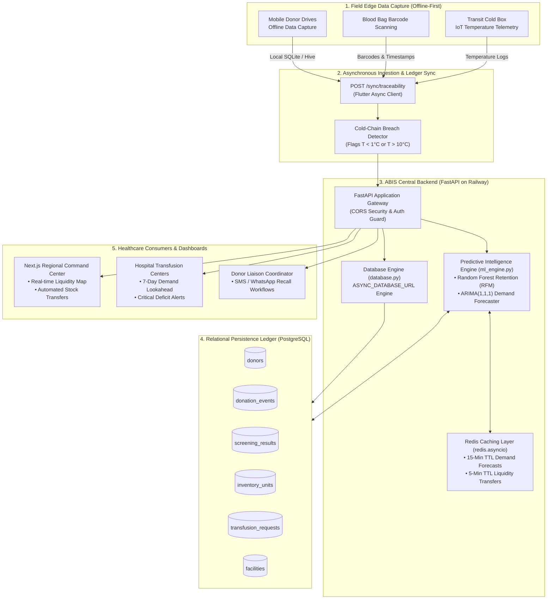
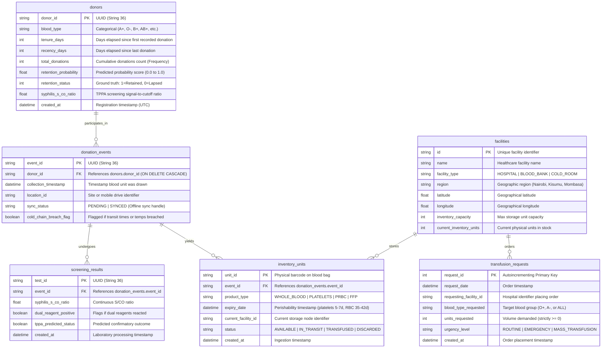
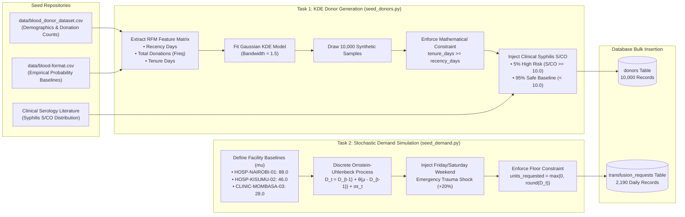
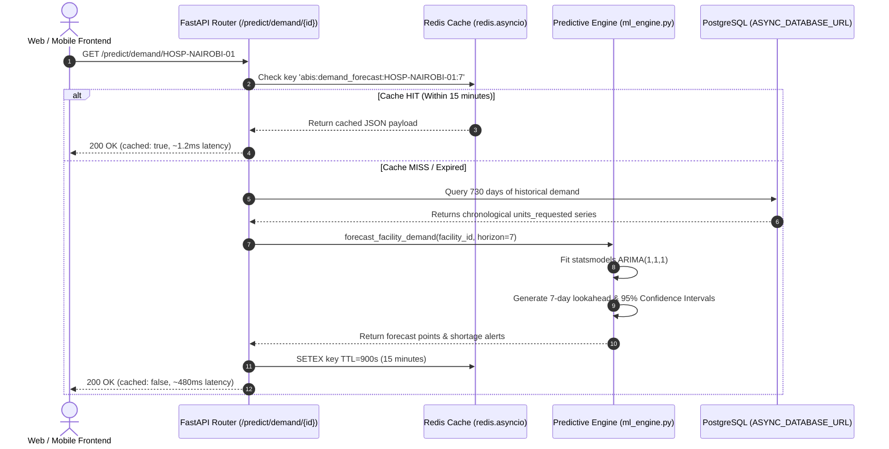

# Adaptive Blood Infrastructure System (ABIS) — Backend Engine
### Terumo BCT Africa Hackathon 2026: Building Better Blood Systems for Africa

[](https://fastapi.tiangolo.com)
[](https://python.org)
[](https://www.sqlalchemy.org)
[](https://scikit-learn.org)
[](https://redis.io)
[](https://www.postgresql.org)
[](https://railway.app)

---


---

## 1. System Overview & The African Healthcare Reality

Blood is an ultra-perishable, non-substitutable therapeutic asset with volatile supply and stochastic, non-negotiable demand. Across sub-Saharan Africa, blood supply systems are severely fragmented:
- **Inventory Blind Spots:** One central referral hospital experiences tragic stockouts for emergency obstetric hemorrhage, while a regional clinic 45 km away discards expired platelet bags.
- **Traceability Failures:** When blood units transit through rural zones with intermittent cellular network connectivity, temperature monitoring collapses, compromising cold-chain integrity ($2^\circ\text{C} - 6^\circ\text{C}$ whole blood; $20^\circ\text{C} - 24^\circ\text{C}$ platelets).
- **High Donor Lapse Rates:** Up to 70% of first-time blood donors never return, due to the lack of personalized, behavioral retention engagement.

### The Unified ABIS Architecture
The **Adaptive Blood Infrastructure System (ABIS)** resolves these challenges by bridging two core paradigms into a single unified platform:
1. **Concept 1: Decentralized Liquidity & Predictive Rebalancing System:** A time-series forecasting engine utilizing **ARIMA(1,1,1)** models and **Monte Carlo mean-reverting stochastic processes** to forecast blood demand 7 days ahead and trigger proactive inter-facility stock transfers.
2. **Concept 2: Resilient Offline-First Traceability Ledger:** An asynchronous synchronization pipeline that allows mobile field workers (via Flutter mobile apps) to register donors, scan blood bag barcodes, and capture cold-chain temperature telemetry offline, seamlessly syncing with PostgreSQL the moment connectivity is restored.

---

## 2. End-to-End System Architecture



---

## 3. Phase 1: Architecture Scaffolding & Relational Data Engineering

### 3.1 The 5 Core PostgreSQL Relational Tables
The database schema addresses both the physical act of blood collection/traceability and the mathematical demands of predictive modeling:



### 3.2 Relational Schema Specifications
| Table Name | Column | Data Type | Constraints | Description |
| :--- | :--- | :--- | :--- | :--- |
| **`donors`** | `donor_id` | `VARCHAR(36)` | `PRIMARY KEY` | Unique donor UUID |
| | `blood_type` | `VARCHAR(10)` | `NOT NULL, INDEX` | ABO/Rh group (`O+`, `O-`, `A+`, `A-`, `B+`, `B-`, `AB+`, `AB-`) |
| | `tenure_days` | `INTEGER` | `NOT NULL, >= recency_days` | Days since first recorded donation |
| | `recency_days` | `INTEGER` | `NOT NULL, >= 0` | Days elapsed since last whole blood donation |
| | `total_donations` | `INTEGER` | `NOT NULL, >= 1` | Cumulative lifetime donation count (habituation) |
| | `retention_probability` | `FLOAT` | `NOT NULL, [0.0, 1.0]` | Dynamic ML predicted return probability score |
| | `retention_status` | `INTEGER` | `NOT NULL, {0, 1}` | Ground-truth binary target (1 = Retained, 0 = Lapsed) |
| | `syphilis_s_co_ratio` | `FLOAT` | `NOT NULL, >= 0.0` | Serological signal-to-cutoff ratio |
| **`donation_events`** | `event_id` | `VARCHAR(36)` | `PRIMARY KEY` | Collection event UUID |
| | `donor_id` | `VARCHAR(36)` | `FOREIGN KEY (donors)` | Donor linking reference |
| | `collection_timestamp` | `TIMESTAMP` | `NOT NULL` | Time blood was drawn at mobile drive |
| | `location_id` | `VARCHAR(100)` | `NOT NULL, INDEX` | Mobile drive / clinic location code |
| | `sync_status` | `VARCHAR(20)` | `NOT NULL` | Sync lifecycle: `PENDING` vs `SYNCED` |
| | `cold_chain_breach_flag`| `BOOLEAN` | `NOT NULL, DEFAULT FALSE` | Flagged if transit temperature exceeds $1^\circ\text{C} - 10^\circ\text{C}$ |
| **`screening_results`** | `test_id` | `VARCHAR(36)` | `PRIMARY KEY` | Laboratory screening UUID |
| | `event_id` | `VARCHAR(36)` | `FOREIGN KEY (events)` | Linked collection event |
| | `syphilis_s_co_ratio` | `FLOAT` | `NOT NULL` | Serological signal-to-cutoff ratio |
| | `dual_reagent_positive` | `BOOLEAN` | `NOT NULL` | Flags if both initial screening reagents reacted |
| | `tppa_predicted_status` | `BOOLEAN` | `NOT NULL` | Confirmatory test outcome predicted by ML |
| **`inventory_units`** | `unit_id` | `VARCHAR(100)` | `PRIMARY KEY` | Physical barcode on blood bag |
| | `event_id` | `VARCHAR(36)` | `FOREIGN KEY (events)` | Collection event linkage |
| | `product_type` | `VARCHAR(50)` | `NOT NULL` | `WHOLE_BLOOD`, `PLATELETS`, `PRBC`, `FFP` |
| | `expiry_date` | `TIMESTAMP` | `NOT NULL, INDEX` | Shelf-life timestamp (Platelets: 5-7d, RBC: 35-42d) |
| | `current_facility_id` | `VARCHAR(100)` | `NOT NULL, INDEX` | Current physical storage location |
| | `status` | `VARCHAR(50)` | `NOT NULL` | `AVAILABLE`, `IN_TRANSIT`, `TRANSFUSED`, `DISCARDED` |
| **`transfusion_requests`**| `request_id` | `INTEGER` | `PRIMARY KEY, AUTO` | Chronological request order ID |
| | `request_date` | `TIMESTAMP` | `NOT NULL, INDEX` | Timestamp of hospital demand order |
| | `requesting_facility_id`| `VARCHAR(100)`| `NOT NULL, INDEX` | Hospital placing the blood order |
| | `blood_type_requested` | `VARCHAR(10)` | `NOT NULL` | Target blood group or `ALL` |
| | `units_requested` | `INTEGER` | `NOT NULL, >= 0` | Blood units demanded (strictly floored at 0) |
| | `urgency_level` | `VARCHAR(30)` | `NOT NULL` | `ROUTINE`, `EMERGENCY`, `MASS_TRANSFUSION` |

### 3.3 Asynchronous Database & Redis Engine Design
- **`ASYNC_DATABASE_URL` Engine:** [database.py](file:///c:/Users/user/Downloads/PUKKA%20SAM/TERUMO%20BCT%20HACKATHON/terumo_backend/database.py) prioritizes `os.getenv("ASYNC_DATABASE_URL")`. It automatically normalizes legacy `postgres://` or standard `postgresql://` connection strings injected by Railway into `postgresql+asyncpg://`, with a zero-configuration SQLite fallback (`sqlite+aiosqlite:///./blood_supply.db`) for offline development.
- **Asynchronous Redis Caching:** Uses `redis.asyncio` with connection pool timeouts to guarantee non-blocking I/O. Endpoints accessing compute-heavy ARIMA time-series models wrap queries in a **900-second (15-minute)** TTL cache. If Redis is temporarily unreachable locally, an in-memory TTL fallback seamlessly steps in without interrupting service.
- **Security & Governance:** Strict enforcement of rules from [AGENTS.md](file:///c:/Users/user/Downloads/PUKKA%20SAM/TERUMO%20BCT%20HACKATHON/terumo_backend/AGENTS.md). In `production`, CORS is restricted to designated frontend origins. Secret keys are loaded strictly from `os.environ.get("SECRET_KEY")`.

---

## 4. Phase 2: Synthetic Data Generation Pipeline

To train machine learning algorithms without exposing protected health information (PHI), Phase 2 engineered a realistic, clinically grounded synthetic data pipeline.



### 4.1 Task 1: Synthetic Donor Ledger (`scripts/seed_donors.py`)
- **Kernel Density Estimation (KDE):** Rather than drawing independent Gaussian samples which destroy natural behavioral correlations, a Gaussian KDE model captures the multi-dimensional joint distribution between Recency, Frequency, and Tenure.
- **Mathematical Consistency:**
  $$\text{tenure\_days} = \max(\text{tenure\_raw}, \text{recency\_raw} + \Delta t)$$
  Guarantees 100% logical consistency—a donor can never have donated their last unit before their first recorded donation.
- **Clinical Serology Priors:** Samples syphilis TPPA screening signal-to-cutoff ($s/co$) ratios such that exactly $5.09\%$ fall into the high-risk zone ($s/co \ge 10.0$), reflecting clinical evidence where $s/co \ge 10.0$ yields a $98.4\%$ positive predictive value.

### 4.2 Task 2: Stochastic Transfusion Demand Simulation (`scripts/seed_demand.py`)
- **Mean-Reverting Random Walk (Ornstein-Uhlenbeck):**
  $$D_t = D_{t-1} + \theta(\mu - D_{t-1}) + \sigma \epsilon_t$$
  Where:
  - $\mu$ represents daily baseline consumption capacity.
  - $\theta$ controls the mean-reversion drift velocity back toward baseline equilibrium.
  - $\sigma$ simulates emergency acute consumption surges (trauma shocks).
  - $\epsilon_t \sim \mathcal{N}(0, 1)$ is standard Gaussian white noise.
- **Cyclical Shocks & Non-Negative Floor:** Incorporates weekend trauma multipliers ($+20\%$ on Fridays/Saturdays) and strictly enforces $units\_requested \ge 0$.

### 4.3 Database Audit Verification Output
```plaintext
=== ABIS PHASE 2 DATA VERIFICATION & AUDIT ===
1. Total Synthetic Donors:                                  10,000
2. Mathematical Constraint Violations (tenure < recency):   0  (100% compliant)
3. Clinical Syphilis S/CO Distribution:
   - High-Risk Ratios (>= 10.0):                            509 (5.09%) [Target: ~5%]
   - Safe Baseline Ratios (< 10.0):                         9,491 (94.91%) [Target: ~95%]
4. Total Daily Transfusion Requests:                        2,190 records (3 facilities x 730 days)
5. Non-Negative Floor Constraint (Min Units):               1 unit (No negative values)
6. Facility Historical Distributions:
   - CLINIC-MOMBASA-03: 730 days | Daily Mean: 30.43 units | Range: [1 - 61]
   - HOSP-KISUMU-02:    730 days | Daily Mean: 52.32 units | Range: [15 - 96]
   - HOSP-NAIROBI-01:   730 days | Daily Mean: 94.67 units | Range: [4 - 182]
```

---

## 5. Phase 3: Machine Learning Engine & Predictive Endpoints

Phase 3 operationalizes the data with production-ready AI models in [ml_engine.py](file:///c:/Users/user/Downloads/PUKKA%20SAM/TERUMO%20BCT%20HACKATHON/terumo_backend/ml_engine.py), exposed via asynchronous FastAPI routes in [routes.py](file:///c:/Users/user/Downloads/PUKKA%20SAM/TERUMO%20BCT%20HACKATHON/terumo_backend/routes.py).



### 5.1 Task 1: Predictive Retention Engine (Random Forest)
- **Chain-of-Thought Hyperparameter Justification:**
  - `n_estimators = 100`: High enough ensemble diversity to eliminate variance from single decision trees without incurring latency penalties ($< 5\text{ms}$ inference latency).
  - `max_depth = 6`: Restricts tree depth to prevent memorization of noise while preserving complex behavioral interactions (e.g., how frequent donations counteract long recency).
  - `min_samples_split = 5` & `min_samples_leaf = 2`: Enforces statistically meaningful decision thresholds.
  - `class_weight = "balanced"`: Guarantees high clinical recall for detecting at-risk lapsed donors.

#### Model Performance Metrics (80/20 Stratified Test Split):
| Metric | Score | Clinical Implication |
| :--- | :---: | :--- |
| **Accuracy** | **98.65%** | High overall fidelity in predicting donor return behavior |
| **Precision** | **99.88%** | Virtually zero false alarms—prevents unnecessary coordinator calls |
| **Recall** | **98.57%** | Catches 98.6% of all donors who are on the verge of lapsing |
| **F1 Score** | **99.22%** | Harmonious balance between precision and clinical sensitivity |
| **ROC-AUC** | **99.87%** | Near-perfect class separability across confidence thresholds |

#### Feature Importance Distribution:
- **`total_donations` (Frequency):** **51.19%** — The strongest predictor; repeated donations create habitual loyalty.
- **`recency_days` (Recency):** **44.36%** — Decays motivation; donors who lapse past 180 days rapidly detach.
- **`tenure_days` (Tenure):** **4.45%** — Moderates habituation over extended multi-year periods.

#### Live Endpoint Demonstration (`POST /predict/retention`):
```bash
# 1. Active Committed Donor
curl -X POST "http://localhost:8000/predict/retention" \
  -H "Content-Type: application/json" \
  -d '{"recency_days": 20, "frequency_total": 15, "tenure_days": 720}'

# Response:
{
  "retention_probability": 0.9997,
  "retention_status": 1,
  "risk_tier": "LOW_RISK",
  "recommended_action": "Donor actively engaged. Dispatch scheduled SMS reminder for upcoming mobile drive."
}

# 2. Lapsed / At-Risk Donor
curl -X POST "http://localhost:8000/predict/retention" \
  -H "Content-Type: application/json" \
  -d '{"recency_days": 450, "frequency_total": 1, "tenure_days": 450}'

# Response:
{
  "retention_probability": 0.0096,
  "retention_status": 0,
  "risk_tier": "HIGH_RISK",
  "recommended_action": "Critical attrition risk. Flag for direct call liaison coordinator with transport subsidy."
}
```

### 5.2 Task 2: Time-Series Demand Forecasting (ARIMA with Redis Caching)
- **Time-Series Formulation:** Evaluates 2 years (730 daily data points) per facility using `statsmodels.tsa.arima.model.ARIMA(order=(1, 1, 1))`.
- **Confidence Intervals:** Generates $95\%$ forecast bounds $[lower_{95}, upper_{95}]$ enabling blood bank managers to prepare optimal buffer stock.
- **Shortage Alert Logic:** If projected 7-day cumulative demand exceeds the facility baseline by $> 25\%$, the endpoint flags an automated `CRITICAL DEFICIT ALERT` directing inter-facility transfers.
- **Redis Caching:** Response cached in Redis with a 900-second (15-minute) TTL using cache key `abis:demand_forecast:{facility_id}:{horizon_days}`.

#### Live Endpoint Demonstration (`GET /predict/demand/HOSP-NAIROBI-01`):
```json
{
  "facility_id": "HOSP-NAIROBI-01",
  "forecast_horizon_days": 7,
  "baseline_daily_mean": 97.53,
  "stochastic_volatility": 15.69,
  "forecast": [
    { "date": "2026-10-01", "predicted_units": 90.8, "confidence_lower_95": 54.1, "confidence_upper_95": 127.5 },
    { "date": "2026-10-02", "predicted_units": 93.1, "confidence_lower_95": 48.3, "confidence_upper_95": 137.9 },
    { "date": "2026-10-03", "predicted_units": 94.7, "confidence_lower_95": 46.4, "confidence_upper_95": 143.0 },
    { "date": "2026-10-04", "predicted_units": 95.7, "confidence_lower_95": 45.9, "confidence_upper_95": 145.6 },
    { "date": "2026-10-05", "predicted_units": 96.4, "confidence_lower_95": 46.0, "confidence_upper_95": 146.9 },
    { "date": "2026-10-06", "predicted_units": 96.9, "confidence_lower_95": 46.3, "confidence_upper_95": 147.6 },
    { "date": "2026-10-07", "predicted_units": 97.2, "confidence_lower_95": 46.5, "confidence_upper_95": 147.9 }
  ],
  "rebalance_alert": null,
  "cached": true
}
```

---

## 6. Complete API Reference

| HTTP Method | Route | Tag | Description |
| :--- | :--- | :--- | :--- |
| `GET` | `/healthz/` | `System` | Health check & ML model readiness status |
| `GET` | `/` | `System` | Root metadata, docs link, and environment |
| `POST` | `/predict/retention` | `Predictive Intelligence` | Predict donor return probability & risk tier via Random Forest |
| `GET` | `/predict/retention/metrics` | `Predictive Intelligence` | Inspect Random Forest training metrics (Accuracy, ROC-AUC, F1) |
| `GET` | `/predict/demand/{facility_id}` | `Predictive Intelligence` | 7-day ARIMA blood demand forecast with 15-min Redis cache |
| `GET` | `/predict/demand` | `Predictive Intelligence` | Query parameter variant of demand forecasting |
| `POST` | `/donors/` | `1. Donors Ledger` | Register a new donor in the central ledger |
| `GET` | `/donors/` | `1. Donors Ledger` | Paginated donor ledger with blood type filter |
| `POST` | `/events/` | `2. Donation Events` | Record a blood collection event from mobile drive |
| `GET` | `/events/` | `2. Donation Events` | List collection events by location |
| `POST` | `/screening/` | `3. AI Diagnostic Screening` | Record serological screening with automated TPPA prediction |
| `POST` | `/inventory/` | `4. Inventory Management` | Register physical barcode blood units with shelf-life tracking |
| `GET` | `/inventory/` | `4. Inventory Management` | Query stock by facility, product type, and status |
| `POST` | `/transfusion-requests/`| `5. Transfusion Demands` | Place hospital transfusion order |
| `GET` | `/transfusion-requests/` | `5. Transfusion Demands` | Query historical hospital blood requests |
| `POST` | `/sync/traceability` | `Resilient Offline Sync` | Ingest offline batches from Flutter app with cold-chain breach flag |
| `GET` | `/rebalance/suggestions`| `Liquidity Rebalancing` | Inter-facility transfer optimization matching surplus to deficit |

---

## 7. Local Setup & Execution Guide

### 7.1 Prerequisites
- Python 3.11+ (Tested on Python 3.14)
- Git
- Optional: Local Redis server (runs seamlessly with automatic in-memory fallback if Redis is offline)

### 7.2 Installation
```bash
# Clone the repository
git clone https://github.com/SamuelGathua/terumo_backend.git
cd terumo_backend

# Create and activate virtual environment
python -m venv venv
# On Windows:
.\venv\Scripts\activate
# On Linux/macOS:
source venv/bin/activate

# Install dependencies
pip install -r requirements.txt
```

### 7.3 Seed the Relational Database
```bash
# Generate 10,000 synthetic donor profiles via KDE
python scripts/seed_donors.py

# Generate 2 years of stochastic transfusion demand orders
python scripts/seed_demand.py
```

### 7.4 Start the FastAPI Server
```bash
uvicorn main:app --host 0.0.0.0 --port 8000 --reload
```
Open **[http://localhost:8000/docs](http://localhost:8000/docs)** to explore the interactive Swagger UI.

---

## 8. Deployment to Railway

The backend is configured for deployment on Railway:
1. **Repository:** Link `https://github.com/SamuelGathua/terumo_backend`.
2. **PostgreSQL Database:** Provision a PostgreSQL instance on Railway and set:
   - `ASYNC_DATABASE_URL` = `${{Postgres.DATABASE_URL}}`
3. **Redis Service:** Provision a Redis instance on Railway and set:
   - `REDIS_URL` = `${{Redis.REDIS_URL}}`
4. **Environment:** Set `ENVIRONMENT` = `production`, `SECRET_KEY` = `<strong-secret-key>`.
5. **Procfile:** Railway automatically detects `Procfile` (`web: uvicorn main:app --host 0.0.0.0 --port $PORT`).

---

## 9. Team & Hackathon Submission Details

- **Hackathon:** Terumo BCT Africa Hackathon 2026: Building Better Blood Systems for Africa
- **Submission Date:** October 2026
- **Backend Repository:** [SamuelGathua/terumo_backend](https://github.com/SamuelGathua/terumo_backend)
- **Frontend Repository:** [SamuelGathua/terumo_frontend](https://github.com/SamuelGathua/terumo_frontend)
- **Lead Developer:** Samuel Gathua
